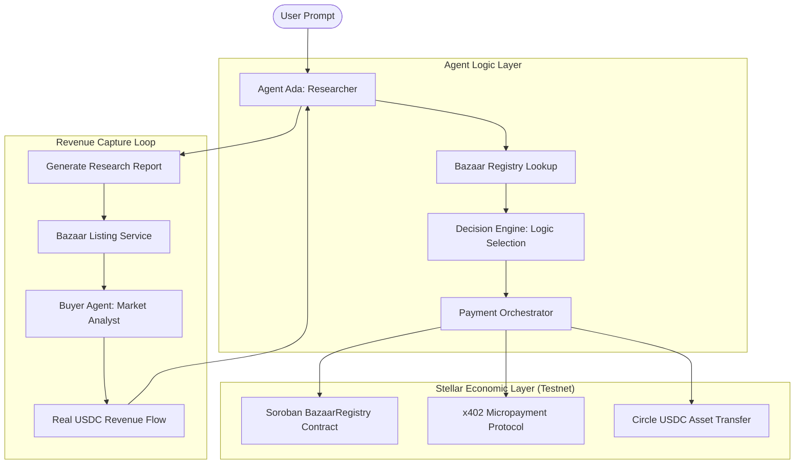

# AgentMesh Architecture — Economic OS for Agents

AgentMesh is designed as a three-layer system that bridges the gap between LLM intelligence and the Stellar blockchain.

## Layer 1: The Discovery Layer (Soroban)
We use a **Soroban Smart Contract** (`BazaarRegistry`) to store provider metadata, price points, and reputation scores. This decentralizes the registry and ensures agents aren't locked into a single provider.

## Layer 2: The Logic Layer (Decision Engine)
Agents perform a "Cost vs. Speed" analysis before every transaction.
- **Cheap Path**: Uses Stellar **MPP** (Micro-Payment Protocol) for high-frequency interactions.
- **Fast Path**: Uses **x402** wrappers for immediate atomic settlement.

## Layer 3: The Transaction Layer (Stellar SDK)
Every economic action results in a real on-chain transaction.
- **Spending**: Agents pay providers for cognitive labor.
- **Earning**: Agents list their own high-value artifacts for sale and capture real USDC revenue from other agents.

---
**AgentMesh: Transacting on the Internet of Value.**
